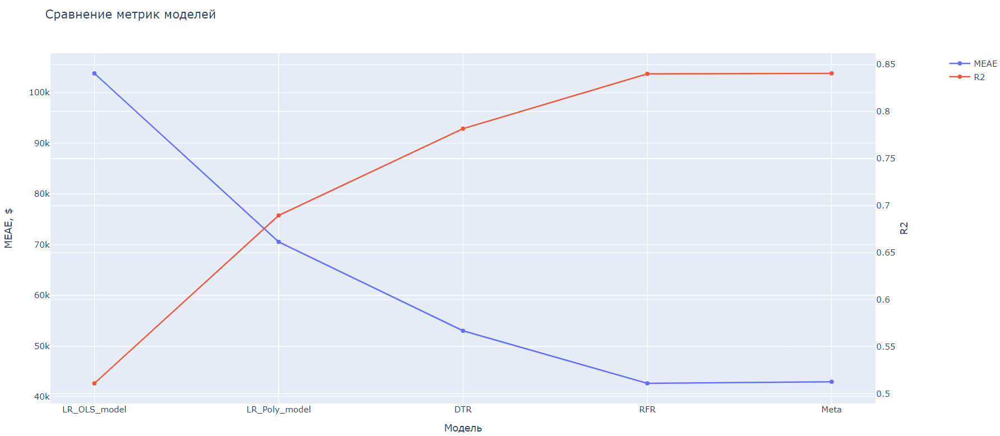
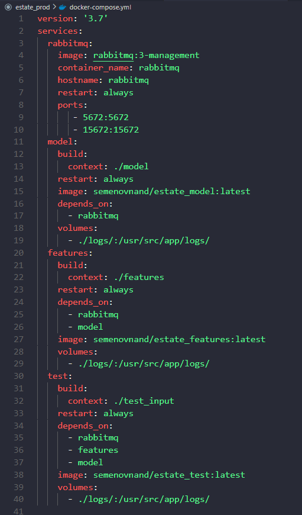
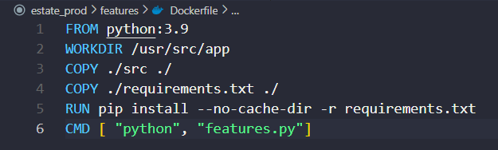
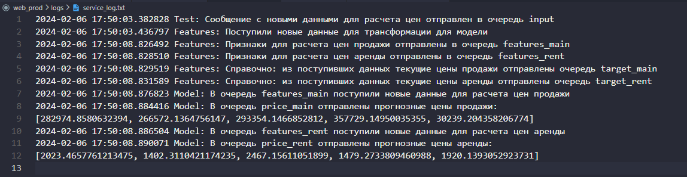

# Проект - Модель прогнозирования цен жилья для агентства недвижимости

## Оглавление  
[1. Описание проекта](.README.md#Описание-проекта)  
[2. Постановка задачи](.README.md#Постановка-задачи)  
[3. Краткая информация о данных](.README.md#Краткая-информация-о-данных)  
[4. Этапы работы над проектом](.README.md#Этапы-работы-над-проектом)  
[5. Результаты](.README.md#Результаты)    
[6. Выводы](.README.md#Выводы) 

### Описание проекта    
Данная работа посвящена обучению модели, способной по характеристикам объекта недвижимости прогнозировать его цену. Работа выполнена на реальных данных из системы мультилистинга риэлтора, представляющих собой датасет из более чем 370 тыс. записей. Исходные данные сильно замусорены, поэтому около 80% всей трудоемкости данной работы затрачено на этап очистки данных и генерацию новых признаков.
Конечной целью работы является подготовка модели, способной работать в продуктивной среде.

:arrow_up:[к оглавлению](.README.md#Оглавление)

### Постановка задачи

**Бизнес-задача:** разработать модель, которая позволила бы агентству недвижимости обойти конкурентов по скорости и качеству совершения сделок.

**Техническая задача для специалиста в Data Science:** построить модель регрессии - прогнозирования цен на объекты недвижимости, исходя из представленных в датасете характеристик; подготовить модель для возможности работы в продуктивной среде.

### Краткая информация о данных
В качестве источника данных используется файл data.csv.

Загрузить его можно по ссылке https://disk.yandex.ru/d/48jgsZ9J2yoyFQ

Также в ходе работы над одним из признаков испольвалась база всех населенных пунктов и иных географических объектов США - файл US_text.txt.

Загрузить его можно по ссылке https://disk.yandex.ru/d/R2CH2E1_nEgqwA

:arrow_up:[к оглавлению](.README.md#Оглавление)

### Этапы работы над проектом  
Работу можно разделить на исследовательскую часть и внедрение в продакшн.

**Исследовательская часть** представлена в ноутбуке FINAL_PROJECT-RESEARCH.ipynb и включает в себя следующие этапы:
1. Очистка данных и трансформация признаков - первая попытка.
2. Построение базовой, самой простой модели после первого этапа трансформации.
3. Очистка данных и трансформация признаков - вторая попытка, более глубокая переработка.
4. Построение серии моделей и выбор лучшей.
5. Адаптация кода для использования в продакшн.

*Примечание: если вы будете запускать код ноутбука FINAL_PROJECT-RESEARCH.ipynb, то придется запастись терпением. Средняя длительность выполнения кода составляет около 2,5 часов. Это обусловлено, во-первых, использованием геобиблиотек для идентификации городов, во-вторых - длительностью подбора параметров для ансамблевых моделей, а в-третьих - исследовательским стилем изложения, в котором этап трансформации данных по сути выполняется дважды, но с разной степенью проработки. Также, в связи с ограничением GitHub на размер файлов, вам нужно будет скачать и сохранить в папку components файл us_cities.pickle, доступный по ссылке https://disk.yandex.ru/d/-l4XIHQ7JQUypw .*

**Внедрение в продакш** заключается в создании микросервисного приложения, в котором сервис предобработки данных (features) получает на вход сырые данные в таком же формате, как исходные данные для работы, выполняет их очистку и трансофрмацию в соответствии с выработанными в ходе исследования алгоритмами и передает во второй сервис (model), выполняющий собственно прогнозрирование. В рамках этого этапа выполнены:
1. Дополнении кода, подготовленного на шаге 5 исследовательской части, сервисной частью, "обвязкой" для работы в качестве микросервисов с брокером сообщений Rabbitmq.
2. Фиксация окружения - версий установленных библиотек.
3. Создание еще одного приложения - test_source.py, задача которого состоит в считывании новых тестовых данных из каталога и передаче их сообщением в сервис features.
4. Спецификация файлов Dockerfile и Docker-compose для создания docker-образов и оркестрации микровервисов.

:arrow_up:[к оглавлению](.README.md#Оглавление)

### Результаты
В ходе исследовательской части попробованы различные модели, сравнение которых по метрикам R2-score и MedianAbsoluteError приведено ниже:

В качестве лучшей модели выбрана модель Random Forest Regressor.

Особенностью данной работы является то, что мы разделили данные на 2 принципиально разных класса - объявления о продаже и об аренде. Причина такког разделения кроется в существенной разнице в порядке цен на объекты. Основной моделью является указанная выше Random Forest Regressor для объявлений о продаже, а для объявлений об аренде (их, к слову, в датасете оказалось всего чуть более 400) - построили более простую модель Linear Regression с приемлемой точностю прогнозирования.

В ходе подготовки модели к продакш были собраны образы:
- estate_features;
- estate_model;
- estate_test.

Они доступны для скачивания по ссылкам:
- https://hub.docker.com/repository/docker/semenovnand/estate_features/general
- https://hub.docker.com/repository/docker/semenovnand/estate_model/general
- https://hub.docker.com/repository/docker/semenovnand/estate_test/general

Для работы сервисов вам также потребуется образ rabbitmq:3-managemet.

Приводим справочно структуру файла docker-compose.yml, которым был собран композит:

Структура Dockerfile по каждому из сервисов типична, на примере сервиса features:

После запуска образа командой *docker-compose up* выводится лог сообщений, демонстрирующий последовательность и результат работы сервисов.
Таким образом, в продакш подается новый датасет в очередь input, а результат - прогноз цен - необходимо вычитывать из очередей price_main (цены продажи) и price_rent (цены аренды), в которые они попадают в зависимости от того, объявления какого типа были поданы в очередь input.
В качестве тестовых данных был подан датасет, содержащий 5 объявлений о продаже и 5 объявлений об аренде. Лог работы сервисов:

**Вы можете воспроизвести всю структуру проекта, распаковав архив estate_prod.zip, доступный по ссылке https://disk.yandex.ru/d/hAimIlVeEHI_-Q .**

:arrow_up:[к оглавлению](.README.md#Оглавление)

### Выводы:  
Выполнена комплексная работа - от исследования структуры данных и погружения в предметную область до создания микросервисов, реализующих инференс модели.

:arrow_up:[к оглавлению](.README.md#Оглавление)

Если информация по этому проекту покажется вам интересной или полезной, то мы будем вам очень благодарны, если отметите репозиторий и профиль ⭐️⭐️⭐️-дами.

Также будем рады, если представленная работа будет использована другими исследователями данной задачи в качестве отправной точки для новых, еще лучших решений.